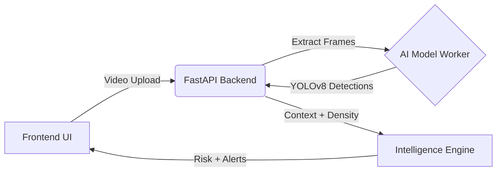

# 🚗 RoadSense AI

[](https://opensource.org/licenses/MIT)
[](https://www.python.org/downloads/)
[](https://reactjs.org/)
[](https://fastapi.tiangolo.com/)
[](https://ultralytics.com)

**RoadSense AI** is a professional full-stack safety analytics system designed to analyze road-view videos and identify potential hazards. By leveraging advanced computer vision and adaptive intelligence, it transforms raw video footage into actionable safety insights, risk scores, and context-aware alerts.

---

## ✨ Key Features

- **🔍 Intelligent Hazard Detection**: Automatic identification of road hazards using state-of-the-art YOLOv8 object detection.
- **📈 Risk Trend Analysis**: Per-frame risk calculation to visualize how safety levels fluctuate throughout a video segment.
- **🚦 Traffic Density Mapping**: Analysis of vehicle and pedestrian density to categorize traffic flow (Low, Medium, High).
- **🧠 Adaptive Alert System**: Context-aware warnings that change based on the detected environment (e.g., _School Zones_, _Market Areas_, _Highways_).
- **👤 Driver Profiling**: Estimation of driver behavior patterns to refine risk assessment.
- **🖥️ Modern Dashboard**: A sleek, interactive React-based interface for video uploads and comprehensive analysis visualization.
- **🐳 Production-Ready Microservices**: Fully containerized with Docker, featuring separated backend, frontend, and dedicated AI model worker services.

---

## 🏗️ System Architecture

RoadSense AI follows a microservice-based pipeline to process video data efficiently:



### Tech Stack

- **Frontend**: React, TypeScript, Vite, Tailwind CSS.
- **Backend Orchestrator**: FastAPI (Python), Uvicorn.
- **AI/ML Worker**: Dedicated FastAPI service running Ultralytics YOLOv8 for heavy inference.
- **DevOps**: Docker, Docker Compose, Nginx.

---

## 🚀 Getting Started

### Option 1: Quick Start with Docker (Recommended)

The fastest way to get the entire system running locally. This will spin up the Frontend, Backend, and AI Model Worker.

```bash
# Clone the repository
git clone https://github.com/your-username/roadsense-ai.git
cd roadsense-ai

# Build and launch the full stack
docker compose up --build
```

**Access the app:**

- 🌐 Frontend: `http://localhost:5173`
- ⚙️ Backend API: `http://localhost:8000`

### Option 2: Production-Style Local Run

Serves the frontend as static assets through Nginx for a production-like experience.

```bash
docker compose -f docker-compose.prod.yml up --build
```

- 🌐 Frontend: `http://localhost:80`
- ⚙️ Backend API: `http://localhost:8000`
- 🤖 Model Worker (Internal): `http://model-worker:8001`

---

## 🛠️ API Reference

| Endpoint             | Method | Description                                 |
| :------------------- | :----: | :------------------------------------------ |
| `/api/upload`        | `POST` | Upload a video file (MP4, AVI, MOV, MKV)    |
| `/api/analyze`       | `POST` | Analyze a previously uploaded video by path |
| `/api/analysis/{id}` | `GET`  | Retrieve a specific analysis report         |
| `/api/dashboard`     | `GET`  | Get the most recent analysis summary        |

---

## 📁 Project Structure

```text
roadsense-ai/
├── backend/                # FastAPI server (Orchestrator)
│   ├── app.py              # Main API entry point
│   ├── services/           # Core business logic (Traffic, Alerts, Video)
│   └── models/             # AI heuristic engines (Risk, Behavior)
├── frontend/               # React application
│   ├── src/                # Frontend source code
│   └── public/             # Static assets
├── model_worker/           # Dedicated YOLOv8 Inference Service
│   └── app.py              # YOLO inference API
├── Dockerfile.backend      # Backend container definition
├── Dockerfile.frontend     # Frontend container definition
├── Dockerfile.model_worker # Model worker container definition
└── docker-compose.yml      # Local orchestration
```

---

## 📜 License

This project is licensed under the MIT License.
