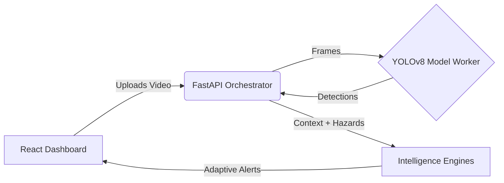

# 🚗 RoadSense AI - Democratizing ADAS Adoption in India

[](https://opensource.org/licenses/MIT)
[](https://www.python.org/downloads/)
[](https://reactjs.org/)
[](https://fastapi.tiangolo.com/)
[](https://ultralytics.com)
[](https://www.docker.com/)

> **Built for ET AutoTech Hackathon 2026**  
> **Theme:** AI for ADAS Adoption in India  
> **Team:** DevMasters (Md. Kamran Alam & Ankur Verma)

**RoadSense AI** is an advanced, edge-ready Advanced Driver Assistance System (ADAS) platform designed to accelerate ADAS adoption across India. Traditional ADAS systems face two major hurdles in the Indian market: the prohibitive cost of luxury vehicles equipped with these systems, and the failure of Western AI models to interpret chaotic Indian road conditions (e.g., mixed traffic, animals, unique vehicle types). RoadSense AI solves this by providing a hyper-localized, affordable intelligence layer that can upgrade any vehicle with context-driven safety alerts using just a standard dashcam.

---

## ✨ Key Features

- **🔍 Hyper-Localized Hazard Detection**: Real-time identification of complex Indian road hazards using state-of-the-art YOLOv8 object detection trained on localized data.
- **🚦 Traffic Density Mapping**: Continuous analysis of vehicle and pedestrian density to categorize traffic flow and adapt driving recommendations.
- **🧠 Adaptive Context Engine**: Context-aware intelligence that understands its environment (e.g., _School Zones_, _Market Areas_, _Highways_, _Village Roads_) and alters risk thresholds accordingly.
- **📈 Real-Time Risk Profiling**: Calculates a dynamic, per-frame risk score by combining hazard presence, environmental context, and traffic density.
- **👤 Driver Profiling**: Estimates driver behavior patterns (Aggressive, Normal, Defensive) to refine risk assessments.
- **🖥️ Modern Safety Dashboard**: A sleek, interactive React-based interface for visualizing video uploads, risk trends, and comprehensive safety intelligence.
- **🐳 Edge & Cloud Ready**: Fully containerized microservices (Docker) allowing for scalable cloud processing or efficient edge deployment directly inside the vehicle.

---

## 🏗️ System Architecture

RoadSense AI uses a robust microservice architecture designed to handle intensive video processing asynchronously, making it highly responsive.



### 🛠️ Tech Stack
- **Frontend**: React 18, TypeScript, Vite, Tailwind CSS
- **Backend Orchestrator**: FastAPI (Python), Uvicorn
- **AI/ML Worker**: Dedicated FastAPI service running Ultralytics YOLOv8 for heavy inference
- **Intelligence Layer**: Custom Python-based heuristic risk, context, and driver behavior engines
- **DevOps**: Docker, Docker Compose, Nginx

---

## 🚀 Getting Started

### Quick Start with Docker (Recommended)

The fastest way to get the entire system running locally. This provisions the Frontend, Backend, and AI Model Worker.

```bash
# Clone the repository
git clone https://github.com/your-username/roadsense-ai.git
cd roadsense-ai

# Build and launch the full stack
docker compose up --build
```

**Access the Application:**
- 🌐 **Dashboard (Frontend)**: `http://localhost:5173`
- ⚙️ **API Documentation (Backend)**: `http://localhost:8000/docs`

### Production-Style Deployment

Serves the frontend as static assets through Nginx for a production-like experience.

```bash
docker compose -f docker-compose.prod.yml up --build
```
- 🌐 Frontend: `http://localhost:80`
- ⚙️ Backend API: `http://localhost:8000`

---

## 🧠 The Intelligence Engines

RoadSense AI is powered by multiple AI and rule-based engines:

1. **Object Detector:** Processes frames to detect vehicles, pedestrians, animals, and traffic signs.
2. **Context Engine:** Determines the road environment (e.g., Urban Congested, Highway) based on detection density.
3. **Hazard Engine:** Flags critical dangers (e.g., pedestrian crossing, animal hazard).
4. **Driver Behavior Engine:** Estimates driving style based on movement speed and hazard encounters.
5. **Risk Predictor:** Aggregates inputs to calculate a global Risk Score (0-100) and Level (Safe, Moderate, High, Critical).

---

## 📜 License

This project is licensed under the MIT License.
